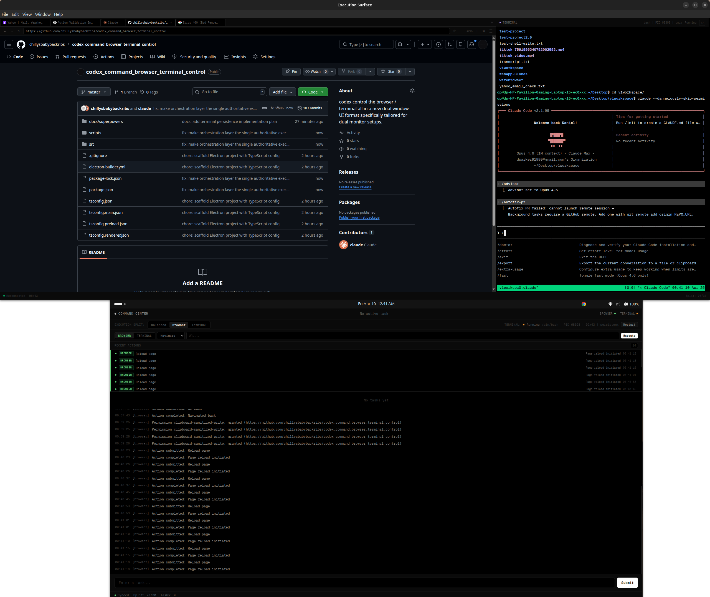

# Codex Command Browser Terminal Control

An Electron workspace with a typed surface orchestration layer for controlling browser and terminal surfaces from a unified command center.



## Architecture

**2 physical windows:**
- **Command Center** — control plane for dispatching actions, managing tasks, viewing logs and action history
- **Execution Window** — browser + terminal split with draggable splitter

**3 logical surfaces:**
- `browser` — multi-tab Chromium browser with navigation, bookmarks, history, downloads, extensions, find-in-page
- `terminal` — PTY-backed terminal with tmux persistence and xterm.js rendering
- `command-center` — action composer, task management, log stream, action history

## Surface Action System

All browser and terminal execution flows through a typed, auditable orchestration layer:

```
Renderer → actions.submit({ target, kind, payload })
  → IPC → SurfaceActionRouter (main process)
    → validate → create record → emit lifecycle events
    → execute via BrowserService / TerminalService
    → capture result → update record → broadcast to all windows
```

**12 action kinds:**

| Browser | Terminal |
|---------|----------|
| `browser.navigate` | `terminal.execute` |
| `browser.back` | `terminal.write` |
| `browser.forward` | `terminal.restart` |
| `browser.reload` | `terminal.interrupt` |
| `browser.stop` | |
| `browser.create-tab` | |
| `browser.close-tab` | |
| `browser.activate-tab` | |

**Lifecycle:** `queued` → `running` → `completed` | `failed`

Every action produces a record with payload summary, result summary, timestamps, and optional task association.

## Key Design Principles

- **Single execution authority** — no parallel bypass paths; all execution goes through the action router
- **Main-process control** — renderers submit actions, main process validates and executes
- **Typed contracts** — discriminated unions for action kinds, typed payloads and results
- **Bounded state** — actions capped at 200, logs at 500, history at 2000
- **Dedicated high-frequency channels** — terminal output and browser nav updates use separate IPC to avoid congestion
- **Secure preload** — `contextBridge.exposeInMainWorld` with explicit API surface, no raw `ipcRenderer` exposure

## Project Structure

```
src/
  shared/
    actions/          # Action type system (kinds, payloads, results, events)
    types/            # App state, events, IPC channels, browser/terminal types
  main/
    actions/          # SurfaceActionRouter, browser/terminal executors
    browser/          # BrowserService, session store, permissions, downloads
    terminal/         # TerminalService (tmux-backed PTY)
    events/           # EventBus, EventRouter
    state/            # AppStateStore, reducer, persistence
    windows/          # WindowManager, layout presets
    ipc/              # IPC handler registration
  preload/            # Context-bridged API (imports shared IPC channels)
  renderer/
    command/          # Command Center UI
    execution/        # Execution window (browser + terminal split)
```

## Development

```bash
npm install
npm run build
npm start
```

## License

ISC
